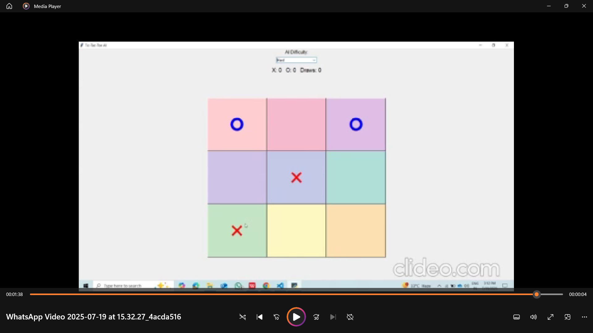
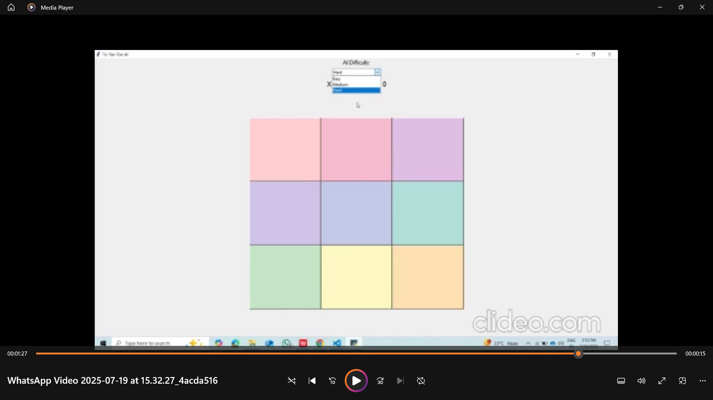

# 🎮 Tic-Tac-Toe Game with AI

A colorful and interactive Tic-Tac-Toe game powered by Python and Tkinter, featuring AI opponents of varying difficulty levels.





---

## ✨ Features

- 🎯 **AI Difficulty Levels**  
  - **Easy** – Random moves  
  - **Medium** – Mix of random and smart  
  - **Hard** – Optimal play using Minimax + Alpha-Beta pruning

- 🧠 Smart AI: Built using the Minimax algorithm for unbeatable gameplay on hard mode  
- 📊 Live Score Tracking: X wins, O wins, and Draws  
- 🖼️ Beautiful UI with colorful blocks and interactive buttons  
- ✅ Lightweight: No external libraries needed

---

## 🧩 How to Play

1. Select AI difficulty from the dropdown.
2. Click any colored box to place your move (`❌`).
3. Watch the AI respond with its move (`⭕`).
4. Win, draw, or try again!

---

## 🚀 Getting Started

### 🔧 Requirements

- Python 3.x
- Tkinter (usually pre-installed with Python)

### 📥 Installation

```bash
git clone https://github.com/mursleenmohd/Tic-Tac-Toe-game-with-AI.git
cd Tic-Tac-Toe-game-with-AI
python main2.py
